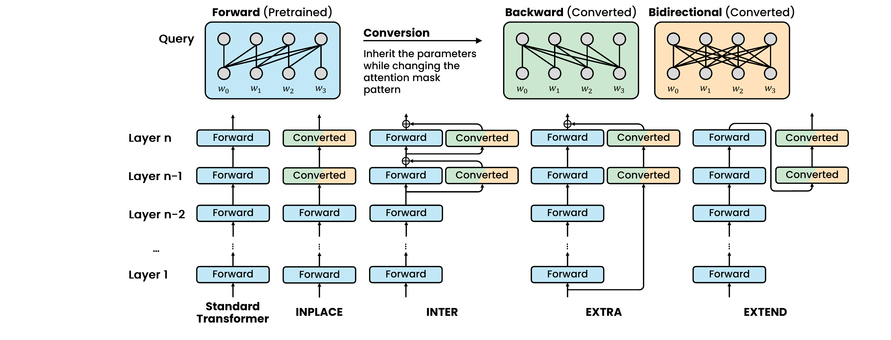
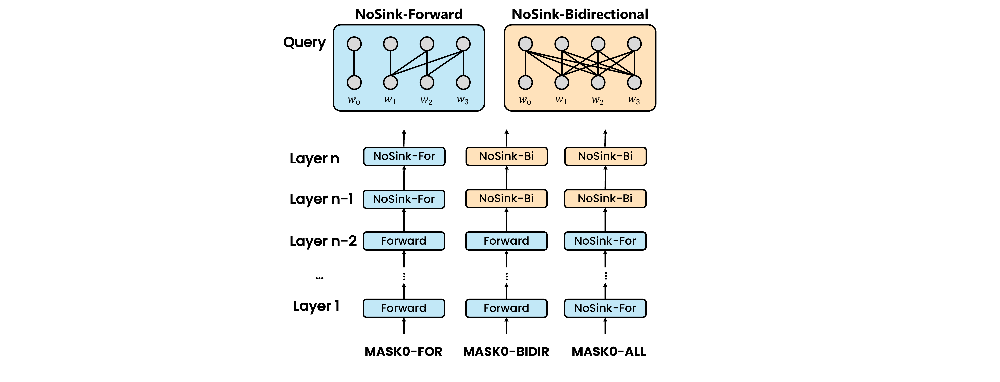
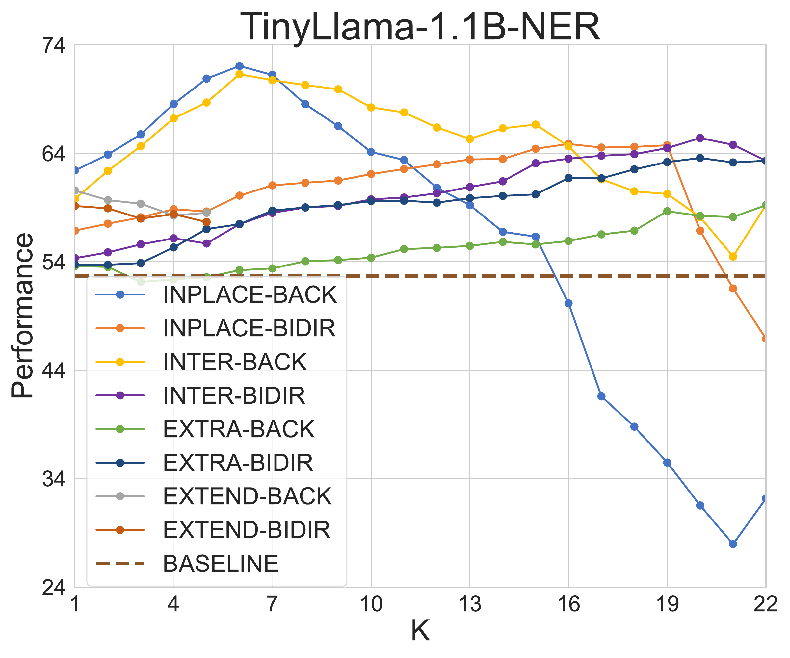
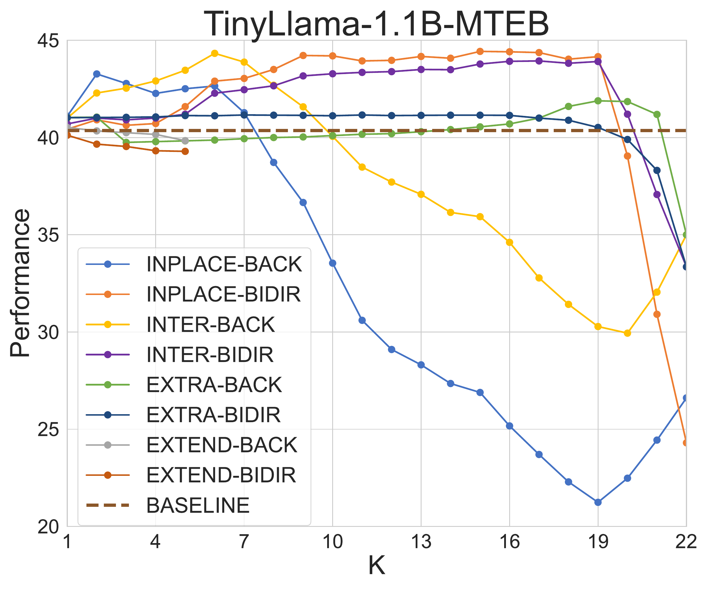
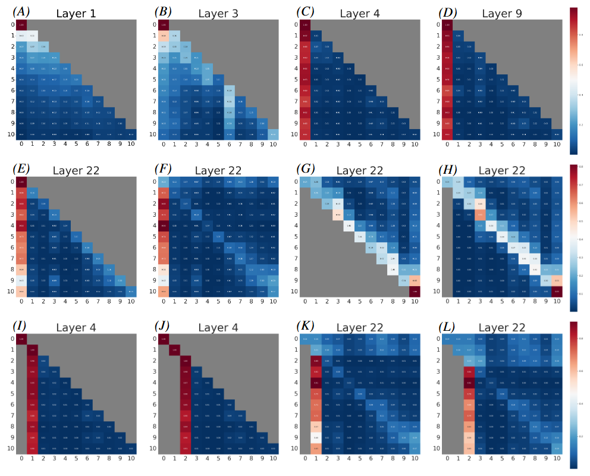
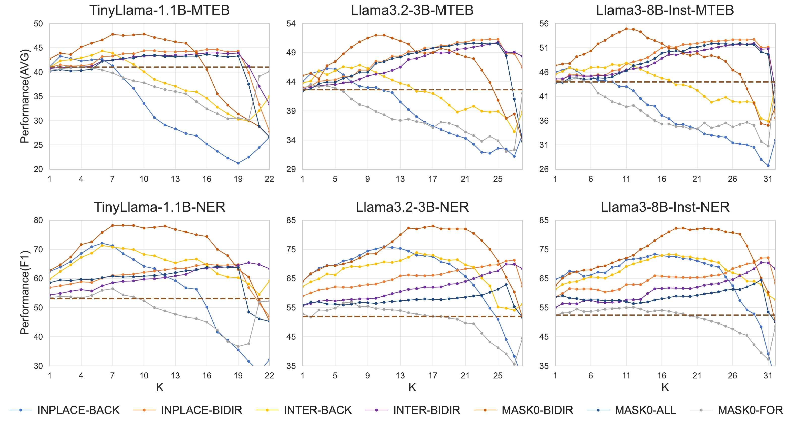
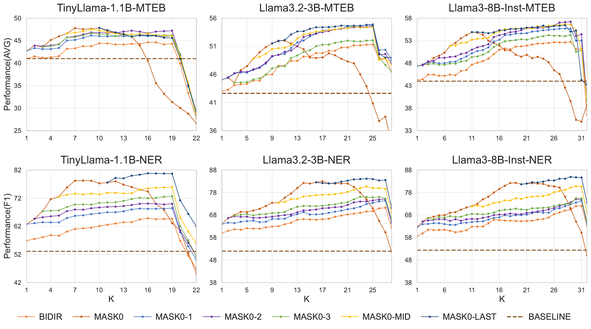

# Look Both Ways and No Sink: Converting LLMs into Text Encoders without Training

## Updates

- (2025.05.16) Our Paper have been accepted by **ACL 2025**🔥🔥.

## 🚀 Overview

In this work, we show that a pretrained large language model can be converted into a strong text encoder __without additional training__.
1. Conduct a __comprehensive empirical study__ to investigate different conversion strategies
2. Identify the impact of the __attention sink phenomenon__ on the performance of converted encoder models.
3. Propose a __novel approach__ that suppresses the attention sink phenomenon, resulting in superior performance.
   
## ⚙️ Installation

```bash
# clone project
git clone https://github.com/bigai-nlco/Look-Both-Ways-and-No-Sink.git

# install requirements
pip install -r requirements.txt

```

## 💡 How to run

All the relevant runtime scripts are placed in the `scripts` folder. 
During use, you only need to modify some parameters within the scripts to run them directly.

For example, if you want to test the model's performance on the NER task, you can run the following command. 

```bash
bash scripts/run_ner.sh
```

If you want to test the model's performance on the MTEB tasks, you can run the following command.

```bash
bash scripts/run_mteb.sh
```

### Parameters

We propose four strategies for converting a pretrained Transformer decoder into encoder, namely __INPLACE__, __INTER__, __EXTRA__, and __EXTEND__. 
The data flow of these architectures is illustrated in the figure below. The types of conversion layers include __BIDIR__ and __BACK__. 



The number of corresponding conversion layers can be controlled by setting the parameters `num_unsink_layers` and `num_bidir_layers`. 
By default, we start converting from the topmost layer of the model (the layer closest to the output). 
When both parameters are set to values greater than zero, we assume that the unsink layer (i.e., BACK) is placed above the bidirectional layer (BIDIR). 
For more fine-grained control over the positions of different types of layers, you can specify the exact locations of the conversion layers by setting the parameters `unsink_layers` and `bidir_layers` as lists.



The type of the unsink layer can be further controlled by setting the parameter `mask_type` to either "MASK0" or "BACK". 
"MASK0" indicates masking the first token, which corresponds to the Nosink-Bidirectional layer in the figure. 

For example, to obtain a MASK0-BIDIR model, you can set the parameters as follows: `mask_type=MASK0, num_unsink_layer=k`. 
To achieve a MASK0&BIDIR model, you can set the parameters as follows: `mask_type=MASK0, num_unsink_layer=k_0, num_bidir_layer=k-k_0`.

## ⚽ Evaluation Results

***Different Architectures***

<div style="display: flex; justify-content: space-between;">
  
  
</div>

***Attention Map Visualization***



***Proposed MASK0-BIDIR and MASK0\&BIDIR***






## Acknowledgement

Data / Code: 
- [LLM2VEC](https://github.com/McGill-NLP/llm2vec.git)
- [E5-Mistral](https://github.com/microsoft/unilm.git)

## 📜 Citation

```tex
@article{linlook,
  title={Look Both Ways and No Sink: Converting LLMs into Text Encoders without Training},
  author={Lin, Ziyong and Wu, Haoyi and Wang, Shu and Tu, Kewei and Zheng, Zilong and Jia, Zixia}
}
```
